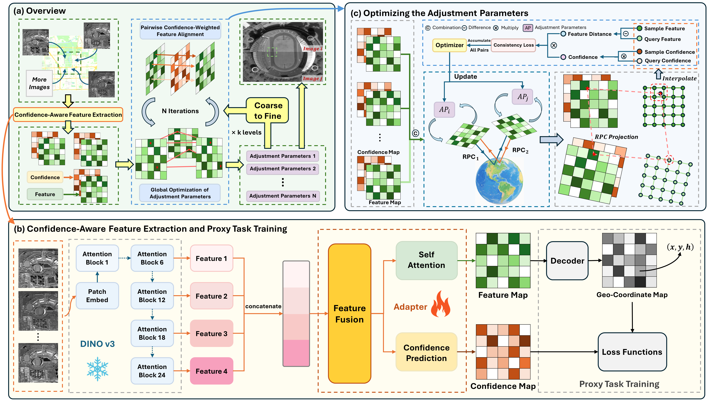

# Beyond-Tie-Points

Beyond-Tie-Points is a multi-view satellite image alignment framework built around:

1. **Encoder pretraining** for robust, confidence-aware dense features.
2. **PBA (Planar Block Adjustment)** for multi-view satellite images based on dense feature consistency.

---

## Table of Contents

- [Introduction](#introduction)
- [Project Structure](#project-structure)
- [Environment Setup](#environment-setup)
- [Encoder Pretraining](#encoder-pretraining)
  - [Pretraining Data Format](#pretraining-data-format)
  - [Run Pretraining](#run-pretraining)
  - [Expected Outputs](#expected-outputs)
- [PBA](#pba)
  - [PBA Input Data Format](#pba-input-data-format)
  - [Run PBA](#run-pba)
  - [Key Arguments](#key-arguments)
  - [Outputs](#outputs)
- [Practical Notes](#practical-notes)
- [Citation](#citation)

## Introduction

Beyond-Tie-Points is a multi-view satellite image alignment framework for **Planar Block Adjustment (PBA)** that moves beyond the traditional **match-then-adjust** pipeline based on sparse tie points. Instead of relying on a limited set of explicit correspondences, the method reformulates satellite image adjustment as a **global dense feature consistency optimization** problem. The goal is to estimate per-image affine corrections on top of the original RPC sensor models so that overlapping images become geometrically consistent across the whole block.

This design is motivated by a key limitation of conventional tie-point-based PBA. In satellite imagery, tie points are often sparse, noisy, and unreliable under weak stereo geometry, large viewpoint changes, seasonal or radiometric variations, and especially in regions with inaccurate elevation or strong parallax such as high-rise urban areas. Errors introduced during feature extraction, matching, and outlier rejection can accumulate irreversibly in the classical cascaded workflow. BeyondTiePoints addresses this issue by optimizing alignment directly in a learned dense feature space, rather than depending on a small set of discrete matches.

At the core of the framework is a **confidence-aware dense feature extractor** built on a frozen DINOv3 ViT-L backbone with a lightweight trainable adapter. The extractor is trained with a **geographic coordinate regression proxy task**, which encourages the output features to be both:
- **geospatially discriminative**, so that different ground locations can be distinguished reliably; and
- **geo-locationally invariant**, so that homologous regions across different views produce similar descriptors despite changes in perspective, appearance, and imaging conditions.

In addition to dense features, the extractor predicts a **pixel-wise confidence map**. This confidence map estimates the reliability of each region and is used to suppress the influence of geometrically unstable areas such as tall buildings, water, clouds, or other large-parallax structures. In this way, the method replaces the hard rejection of outliers used in conventional pipelines with a softer and more adaptive confidence-weighted formulation.

To make dense global optimization practical, BeyondTiePoints adopts a **gridded coarse-to-fine strategy**. The overlapping area of the image block is partitioned into geographic grids, and high-confidence cells are selected for optimization. Within each selected cell, the method samples features from overlapping images, projects object-space locations through the current RPC + affine correction model, and minimizes the distance between corresponding dense features across views. Optimization proceeds hierarchically from coarse grids to finer grids, so that large low-frequency misalignments are corrected first, and higher-frequency residual errors are refined in later stages. This design improves both robustness to large initial errors and computational efficiency.

Overall, the framework consists of two major stages:

1. **Encoder pretraining**  
   Learn dense descriptors and confidence maps using the geographic coordinate regression proxy task.
2. **PBA optimization**  
   Use confidence-weighted dense feature consistency over overlapping grids to optimize affine corrections for all images in the block.



In summary, BeyondTiePoints provides a new PBA paradigm for satellite imagery: it replaces sparse tie-point constraints with dense, learned, confidence-aware geometric consistency, and solves the alignment problem through coarse-to-fine global optimization. This makes the method particularly effective in challenging multi-view satellite scenarios where traditional tie-point-based adjustment is fragile.

---

## Project Structure

```text
.
├── main.py                       # Entry point for PBA
├── adjustment_core/
│   ├── data.py                   # SharedGrid construction and feature extraction
│   ├── ddp.py                    # Distributed runtime wrapper
│   ├── grid.py                   # Grid generation/selection/subdivision/visualization
│   ├── loop.py                   # Optimization loop and feature sampling
│   ├── model.py                  # Affine parameter model
│   ├── utils.py                  # Orthorectification, checkerboard, loaders, logger
│   └── validation.py             # Error report utilities
├── model/
│   ├── encoder.py                # EncoderDino + adapter/confidence head
│   └── decoder.py                # Decoder used in pretraining
├── pretrain/
│   ├── pretrain.py               # Encoder pretraining entry point
│   ├── dataloader.py             # H5 dataset loader and sampling
│   └── criterion.py              # Pretraining losses
├── rpc.py                        # RPC model + affine update/merge
├── rs_image.py                   # RS image wrapper
└── env.yaml                      # Conda environment spec (Python 3.10)
```

---

## Environment Setup

Use the provided `env.yaml` (Python 3.10):

```bash
conda env create -f env.yaml
conda activate byt
```

> The current environment file targets PyTorch + CUDA 12.1 builds. If you need CPU-only runtime, adjust torch/torchvision/cuda packages accordingly.

---

## Encoder Pretraining

### Pretraining Data Format

Pretraining expects HDF5 datasets under `--dataset_path`:

- `train_data.h5`

Each sample key contains at least:

- `images/image_i` (grayscale image)
- `obj` (object-space map: a (H,W,3) matrix recording (x,y,h) coordinates of each pixel)
- `residuals/residual_i`

See `pretrain/dataloader.py` for exact indexing and fields.

### Run Pretraining

A typical distributed launch:

```bash
torchrun --nproc_per_node=4 pretrain/pretrain.py \
  --dataset_path ./path/to/dataset \
  --dino_weight_path ./weights/dinov3_vitl16_pretrain_sat493m-eadcf0ff.pth \
  --encoder_output_path ./weights/pretrain_run \
  --batch_size 8 \
  --max_epoch 1000 \
  --lr_encoder_max 1e-4 \
  --lr_decoder_max 1e-3
```

Single-process debugging example:

```bash
python pretrain/pretrain.py \
  --dataset_path ./path/to/dataset \
  --dino_weight_path ./weights/dinov3_vitl16_pretrain_sat493m-eadcf0ff.pth \
  --encoder_output_path ./weights/pretrain_run \
  --batch_size 2 \
  --max_epoch 1000 \
  --lr_encoder_max 1e-4 \
  --lr_decoder_max 1e-3
```

### Expected Outputs

Depending on your arguments, pretraining writes:

- Encoder/adaptor checkpoints
- Decoder checkpoints
- Logs and optional visualizations

Use the produced `adapter.pth` as `--adapter_path` in PBA.

---

## PBA

### PBA Input Data Format

Set `--root` to a directory containing:

```text
<root>/
└── adjust_images/
    ├── <image_folder_0>/
    │   ├── image.png
    │   ├── dem.npy
    │   ├── rpc.txt
    │   └── tie_points.txt   # optional
    ├── <image_folder_1>/
    │   ├── image.png
    │   ├── dem.npy
    │   └── rpc.txt
    └── ...
```

### Run PBA

```bash
python main.py \
  --root /path/to/input_data \
  --dino_path ./weights \
  --adapter_path ./weights/pretrain_run/adapter.pth \
  --use_ddp auto \
  --num_levels 2 \
  --window_size 2000 \
  --grid_num 16 \
  --max_iter 1000
```

Distributed launch example:

```bash
torchrun --nproc_per_node=4 main.py \
  --root /path/to/inputt_data \
  --dino_path ./weights \
  --adapter_path ./weights/pretrain_run/adapter.pth \
  --use_ddp true \
  --num_levels 2 \
  --window_size 2000
```

### Key Arguments

- `--adapter_path`: pretrained adapter checkpoint used by `EncoderDino`.
- `--use_ddp {auto,true,false}`:
  - `auto`: enable DDP when `WORLD_SIZE > 1`
  - `true`: force DDP
  - `false`: single-process path
- `--num_levels`: number of pyramid levels.
- `--window_size`: base grid size (meters) for level 0.
- `--grid_num`: number of selected grids in level 0.
- `--max_grid_num`: cap for subdivided grids in deeper levels.
- `--select_grid_by_conf`: enable confidence-based grid selection.
- `--patience`, `--min_loss_threshold`: early stopping controls.

### Outputs

Under `<root>/debug_output` (or `<root>/output_<experiment_id>`):

- Grid visualizations
- Checkerboard visualizations per grid
- Per-level baked RPC files
- `loss_log_level_*.txt`
- `final_results.json`

---

## Practical Notes

1. `EncoderDino` loads DINO via local hub path (`./dinov3` in `model/encoder.py`). Ensure the local DINO repo/weights are prepared before running.
2. For reproducibility, keep `--random_seed` fixed.
3. For large scenes, start with smaller `--grid_num` / fewer levels to validate pipeline health before full-scale runs.
4. If using multi-GPU, always launch with `torchrun` and consistent environment variables.

---

## Citation

If this code helps your work, please cite your paper and/or this repository in your publication.

```bibtex
@inproceedings{liu2026beyond,
  title={Beyond Tie Points: Satellite Image Block Adjustment based on Dense Feature Consistency},
  author={Liu, Yi and Wan, Yi and Yu, Lei and Xia, Panwang and Wu, Qiong and Pei, Yingying and Huang, Xuejun and Zhang, Junjian and Cai, Xiangyuan and Hu, Hongwei and Zhang, Yongjun},
  booktitle={Proceedings of the IEEE/CVF Conference on Computer Vision and Pattern Recognition},
  year={2026}
}
```
